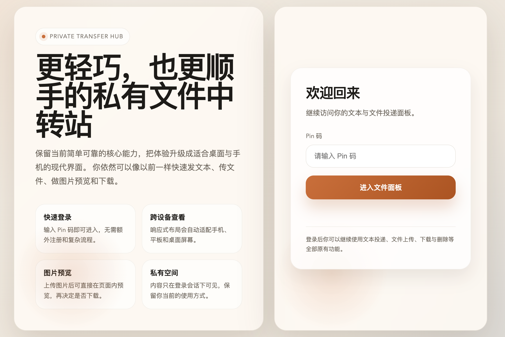
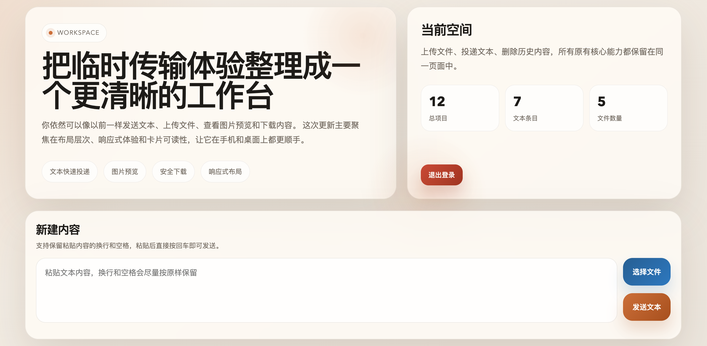

# Some Transfer

一个轻量、自托管的私有文件与文本中转站，适合在个人电脑、家庭服务器、局域网环境或 NAS 上快速投递临时内容。


## 适用场景

- 在自己设备之间临时传文本
- 在手机和电脑之间中转截图、文件、命令输出
- 在家庭网络里搭一个简单可用的私有投递页
- 在 NAS 或小主机上部署一个轻量的内部分享工具

## 界面预览

### 登录界面



### 后台界面




## 项目结构

```text
some-transfer/
├── public/
│   ├── assets/
│   │   └── app-icon.svg
│   ├── index.html
│   └── login.html
├── uploads/
├── config.js
├── server.js
├── store.js
├── Dockerfile
├── docker-compose.yml
├── build-and-run.sh
├── package.json
└── .env.example
```

## 快速开始

### 方式一：本地运行

1. 安装依赖

```bash
npm install
```

2. 创建环境变量文件

```bash
cp .env.example .env
```

3. 至少修改以下配置

- `APP_PIN`
- `SESSION_SECRET`

4. 启动服务

```bash
npm start
```

默认访问地址：

```text
http://localhost:3000
```

### 方式二：Docker Compose

```bash
docker compose up -d --build
```

如果你的环境仍使用旧版命令，也可以：

```bash
docker-compose up -d --build
```

默认端口映射：

- 宿主机：`7300`
- 容器：`3000`

默认访问地址：

```text
http://localhost:7300
```

### 持久化部署说明

如果你希望容器重启、升级或重建后仍然保留上传文件和文本记录，必须把数据目录挂载到宿主机。

当前项目有两类需要持久化的内容：

- 上传文件目录：`/app/uploads`
- 数据文件目录：`/app/data`

仓库内置的 [docker-compose.yml](/Users/reputati0n/Downloads/some-transfer/docker-compose.yml) 已经包含了持久化挂载：

```yaml
volumes:
  - ${APPDATA_ROOT:-/mnt/user/appdata/some-transfer}/uploads:/app/uploads
  - ${APPDATA_ROOT:-/mnt/user/appdata/some-transfer}/data:/app/data
```

这意味着：

- 容器里的 `/app/uploads` 会映射到宿主机的 `uploads` 目录
- 容器里的 `/app/data` 会映射到宿主机的 `data` 目录
- 只要宿主机目录不删，容器重建后数据仍会保留

例如在 NAS、家庭服务器或 Linux 主机上，你可以把 `APPDATA_ROOT` 配成：

```bash
APPDATA_ROOT=/mnt/user/appdata/some-transfer
```

部署完成后，实际持久化数据通常会落在：

```text
/mnt/user/appdata/some-transfer/uploads
/mnt/user/appdata/some-transfer/data
```

如果你不使用仓库自带的 Compose 文件，也请确保至少挂载下面两个路径：

```text
宿主机目录 -> /app/uploads
宿主机目录 -> /app/data
```

否则会出现这些情况：

- 容器删除后，上传文件丢失
- 容器重建后，文本记录丢失
- 镜像更新后，历史数据不可恢复

### 方式三：一键脚本

```bash
chmod +x build-and-run.sh
./build-and-run.sh
```

脚本会自动完成：

- 检查 `.env` 是否存在
- 创建持久化目录
- 构建 Docker 镜像
- 启动容器

## 运行要求

### 本地运行

- Node.js 18 或更高版本
- npm

### Docker 部署

- Docker
- Docker Compose 或 `docker compose`

## 环境变量

项目通过环境变量控制运行参数，核心配置如下：

| 变量名 | 是否必填 | 说明 |
| --- | --- | --- |
| `APP_PIN` | 是 | 登录所需的 Pin 码 |
| `SESSION_SECRET` | 是 | Session 签名密钥，长度至少 32 个字符 |
| `PORT` | 否 | 服务监听端口，默认 `3000` |
| `UPLOAD_DIR` | 否 | 上传文件目录，默认 `./uploads` |
| `DATA_FILE` | 否 | 数据文件路径，默认 `./data.json` |
| `MAX_FILE_SIZE_BYTES` | 否 | 单文件最大体积，默认 `104857600`（100MB） |
| `BODY_LIMIT` | 否 | 请求体大小限制，默认 `64kb` |
| `LOGIN_WINDOW_MS` | 否 | 登录限流时间窗口，默认 `900000` |
| `LOGIN_MAX_ATTEMPTS` | 否 | 限流窗口内最大尝试次数，默认 `5` |
| `TRUST_PROXY` | 否 | 是否信任反向代理，默认 `false` |
| `APP_ORIGIN` | 否 | 服务对外访问地址，用于校验跨站写请求，例如 `https://transfer.example.com` |
| `SESSION_NAME` | 否 | Session Cookie 名称，默认 `some_transfer.sid` |
| `NODE_ENV` | 否 | 运行环境，生产环境建议使用 `production` |

你可以直接基于示例文件生成本地配置：

```bash
cp .env.example .env
```

## 数据存储

- 文本内容和文件元数据保存在 `DATA_FILE`
- 上传的文件本体保存在 `UPLOAD_DIR`
- 本地开发默认使用 `./data.json` 和 `./uploads`
- Docker 部署通过挂载卷把数据保存在宿主机

## License

本项目使用 [MIT License](./LICENSE)。
